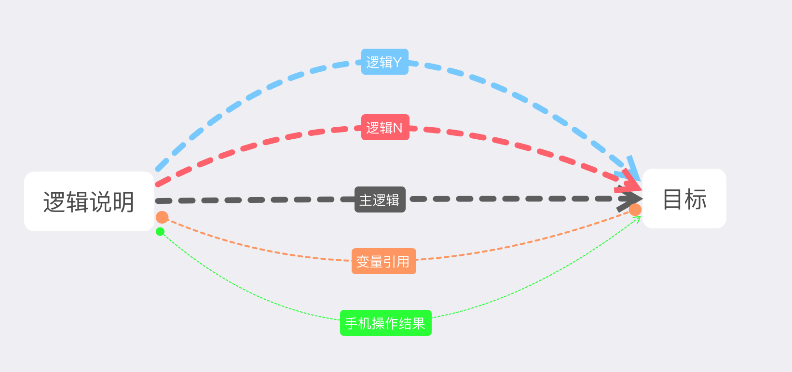

<p align="center">

    <h1 align="center" >Webot</h1>
    <p align="center">这是一个基于web微信协议的简易微信机器人，目前功能比较简陋且不堪🙈。</p>
        <p align="center">
    <a href="https://www.codacy.com/manual/aoii103/Webot?utm_source=github.com&amp;utm_medium=referral&amp;utm_content=aoii103/Webot&amp;utm_campaign=Badge_Grade"></a>
    <a target="_blank" href="https://www.python.org/downloads/" title="Python version"></a>
    <a target="_blank" href="LICENSE" title="License: MIT"></a>
    <a target="_blank" href="Wechat" title="Wechat"></a></p>
</p>


## 现有功能

所有的语音数据将被保存至```datas```文件夹中

所有的摘要、身份、及朋友列表存至```extra```文件夹中

-  简单文字消息回复
-  消息过滤
-  实时信息展示(带斗图表情(MAC平台))
-  语音消息自动播报及保存
-  通讯录导出

## 逻辑图

> `【varb】` 指代变量名 ，逻辑图内均使用python代码

### 指示线



### 登录逻辑图


[mindnode文件](./media/webot_login.mindnode)

## 环境安装

首先保证您已经安装了```python3.7.4```及以上版本,然后依次运行如下命令。

```sh
git clone https://github.com/aoii103/Webot.git

cd webot

python3 -m pip install -r requirements.txt
```

## 额外配置 

在安装好依赖之后,我们在通过```webot/conf.py```该文件进行默认配置修改, 也可以通过```run```方法传入, 各参数作用如下。

-  ```debug = True```  开启debug模式
-  ```play_voice = True```  自动播报声音
-  ```export_xlsx = True```  自动导出好友列表
-  ```need_interaction = False```  交互式shell

## 案例用法
下面是一个简单的文本回复案例即```test.py```

```python
from webot.core import Webot
from webot.util import Device
from pprint import pprint


class bot(Webot):
    @Device.filters(["text"], is_me=True)
    def send_back(self, msg):
        pprint(msg)
        if msg["type"] == "text":
            if "你好" == msg["content"]:
                self.send_text(msg["from"], "你好呀！")


bot().run(True, False)
```

当然我们也可以通过```python3 test.py```直接使用默认测试案例。

以下是运行开始的截图!


## 功能详解

### 1.消息格式

-  `from`为发送者ID
-  `to`为接受者ID

```python
{
	"content": "你好",
	"from": "@1798bad2f5dc126a19450ef2c86aa8e3",
 	"from_nick": "zhangsan",
	"is_group": False,
	"is_me": True,
	"raw_content": "你好",
	"time": 1560230438,
	"to": "@8ef49591902e6c6642732eb7289a5619456u98965f6ea32fa671fe3ab33a002f",
	"to_nick": "filehelper",
	"type": "text"
}

```
### 2.通讯录导出结果

所有的好友、公众号信息都会被保存至```xxx_contacts.xlsx```中。


### 3.语音消息及播报

语音流将会按照被下载存储,并通过pygame播放,但不知为何播放的声音仿佛过了变声器一般。


### 4.机器人预设回复及表情


## TODO

-  文件及图片发送
-  其他更多思考中的功能
-  基于sqlite的消息记录

## 📝 License

This project is [MIT](https://github.com/kefranabg/readme-md-generator/blob/master/LICENSE) licensed.

***

如果您觉得这个脚本对您有用，可别忘了star哟🐶。